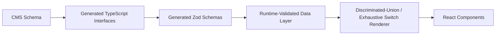
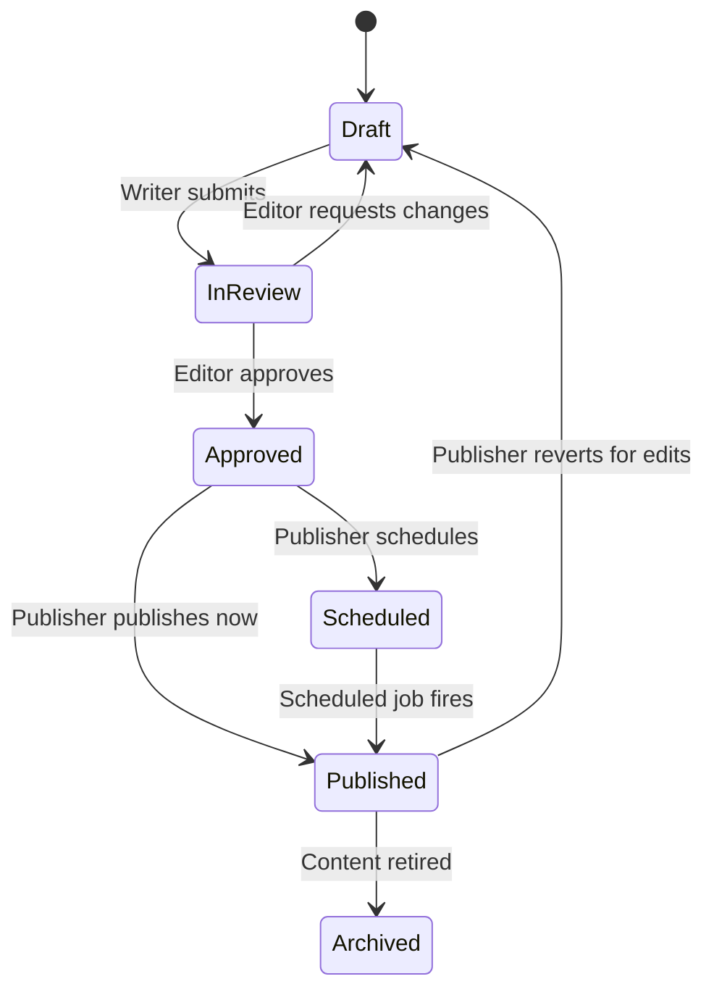

# CMS Content Architecture Specialist

## 1. Mission and Guiding Philosophy

This skill designs headless CMS architectures that let marketing and content teams publish and update website content **independently of engineering**, while preserving strict frontend type safety, SEO quality, and long-term maintainability. It is platform-agnostic (works with Contentful, Sanity, Payload CMS, Strapi, Hygraph, Directus, or similar) but is tuned for a Next.js App Router + TypeScript + Supabase/PostgreSQL + Vercel + React Native Expo PWA stack, in the context of UniqBrio's India-first arts-and-sports-academy SaaS marketing site (goal: convert academy owners into demo bookings, signups, and paid subscriptions).

### Core Principles

- **The CMS is an editorial tool, not a database.** If a routine content change requires an engineer, the architecture has failed.
- **Content outlives presentation.** Structures should evolve, not break; treat content as structured, versioned, relationship-aware data — never as loose text fields.
- **Composition over configuration.** Pages are assembled by editors from reusable, self-contained blocks — never hardcoded layouts.
- **Schema-first, type-derived.** The CMS schema is the single source of truth; TypeScript types and Zod validators are *generated* from it, never hand-maintained in parallel.
- **Defensive, exhaustive rendering.** The frontend must never crash on unexpected or malformed CMS data. Every block-type union must be rendered exhaustively, with a safe fallback for unknown types.
- **Editor empathy.** Every schema decision is also a UX decision for a non-technical marketer — minimize cognitive load and the chance of a publishing mistake.
- **Evolution over perfection.** Assume the schema will change. Plan additive changes, deprecation windows, and migrations from day one rather than treating the first schema as final.

### Recommended Workflow (Decision Process)

1. **Discover the business goal and content use case** (what is this content for, who edits it, how often does it change, what's the conversion role).
2. **Inventory content types and relationships** across the whole site, not just the page at hand.
3. **Design the schema**: apply the normalize/denormalize and reference/embed decision frameworks (Section 3).
4. **Generate types** from the schema (never hand-write parallel TypeScript interfaces).
5. **Map schema to frontend components** via a block registry (Section 5).
6. **Wire up preview/draft workflow** so editors can see unpublished changes safely (Section 7).
7. **Define editorial roles and approval gates** appropriate to the content's blast radius (Section 8).
8. **Plan for evolution**: version fields, deprecation windows, backward-compatible renderers (Section 9).
9. **Validate and test**: Zod runtime validation, schema tests, editorial QA checklist (Section 13).
10. **Ship with safe rollback**: on-demand ISR revalidation, CMS version history, deployment rollback (Sections 7 & 9).

---

## 2. Content Modeling Principles

### 2.1 Normalize vs. Denormalize

| Approach | Use When | Pros | Cons |
|---|---|---|---|
| **Normalize (reference)** | Entity is shared/reused: authors, categories, tags, pricing plans, testimonials, navigation, global settings | Single source of truth; one edit updates everywhere; smaller payloads | Extra API calls/joins; slightly more query complexity |
| **Denormalize (embed)** | Entity is page-specific and unlikely to be reused: a page's own hero copy, a one-off callout | Simple querying, no joins, fast to render | Duplication; must edit each occurrence separately |

**Rule of thumb:** normalize anything that appears (or plausibly could appear) on more than one page or in more than one context; embed anything that is intrinsically tied to a single page's narrative.

### 2.2 Reference vs. Embed vs. Nested

- **Reference** — an ID link to another entry (e.g., a `PricingTable` block referencing `PricingPlan` entries). Use for shared, independently-managed data.
- **Embed** — a full copy of data stored inline (e.g., a `Hero` block's own headline/CTA fields). Use for one-off content that doesn't need independent lifecycle or reuse.
- **Nested** — a hierarchical/array structure within a parent entry (e.g., a `sections` array inside a `LandingPage`). This is the mechanism that makes page builders possible (see Section 5).

### 2.3 Reusable vs. Page-Specific Content

Always model these as **standalone, referenceable** content types (never embed them repeatedly):
CTAs/CTA collections, testimonials, pricing plans, FAQ entries, feature definitions, authors, categories, tags, navigation, footer, global settings, shared assets.

Page-specific content (a landing page's own hero headline, its specific section ordering) stays **embedded/nested** inside the page entry.

### 2.4 Normalize/Denormalize Decision Matrix

| Content Type | Recommendation | Rationale |
|---|---|---|
| Author | Normalize (reference) | Shared across many blog posts |
| Category / Tag | Normalize | Shared taxonomy, must stay consistent |
| Testimonial | Normalize | Reused across many landing pages |
| Pricing Plan | Normalize | Single source of truth for every pricing table sitewide |
| CTA Collection | Normalize | Reused across many pages/sections |
| Global Settings | Single entry (normalized) | Site-wide, never duplicated |
| Landing Page Section / Hero copy | Denormalize (embed within page) | Page-specific, rarely reused verbatim |

### 2.5 Decision Framework for New Content Types

When designing any new content type, ask:

| Question | If Yes | If No |
|---|---|---|
| Does this content need its own URL? | Create a standalone document type (e.g., Blog Post) | Model as a block or reference inside another type |
| Will this be reused across 3+ pages? | Standalone document type, referenced | Embed directly in the block |
| Does the layout depend heavily on this field? | Keep as a plain field (string/boolean) | Model as a structured object/reference |
| Is this field required for the UI to not break? | Mark required in CMS *and* enforce in Zod | Mark optional; design a fallback UI |
| Is the change additive? | Safe — deploy immediately | Treat as breaking; use the migration/versioning path (Section 9) |

---

## 3. Core Content-Model Schemas

All schemas below are written as TypeScript interfaces (the target of CMS-schema codegen), and are platform-agnostic — they map onto Contentful Content Types, Sanity Schema Types, Payload Collections, etc.

### 3.1 Blog Post / Blog Categories / Blog Tags / Author

```typescript
interface BlogPost {
  id: string
  slug: string                    // unique, URL-friendly, immutable once published

  title: string
  excerpt: string                 // ≤160 chars, used for SEO meta description fallback
  featuredImage: Asset
  content: RichText                // supports embedded components (see 3.6)
  readingTime: number              // computed, not editable

  author: Reference<Author>
  categories: Array<Reference<BlogCategory>>
  tags: Array<Reference<BlogTag>>

  seo: SEOFields
  og: OpenGraphFields
  publishedAt: Date
  updatedAt: Date

  status: 'draft' | 'review' | 'approved' | 'scheduled' | 'published' | 'archived'
  publishScheduledFor?: Date
  canonicalUrl?: string
  allowComments?: boolean
  featured?: boolean
  locale?: 'en' | 'hi' | 'ta'      // localization (see 3.9)
}

interface BlogCategory {
  id: string; name: string; slug: string; description?: string; order?: number
}

interface BlogTag {
  id: string; name: string; slug: string
}

interface Author {
  id: string
  name: string
  bio: RichText
  avatar: Asset
  role?: string                    // e.g. "Senior Content Strategist"
  socialLinks: SocialLinks
}
```

### 3.2 Case Study / Customer Testimonial

```typescript
interface CaseStudy {
  id: string
  slug: string
  academyName: string
  academyType: 'cricket' | 'dance' | 'music' | 'football' | 'other'
  summary: string
  heroImage: Asset
  problem: RichText
  solution: RichText
  results: Array<{ metric: string; value: string }>   // e.g. { metric: "Fee collection time", value: "-70%" }
  testimonial: Reference<Testimonial>
  seo: SEOFields
  publishedAt: Date
}

interface Testimonial {
  id: string
  quote: string
  authorName: string
  role: string                     // e.g. "Owner"
  academyName: string
  academyType?: string
  avatar: Asset
  starRating?: number
  featured?: boolean
}
```

### 3.3 Landing Page and Page Sections (Discriminated Union)

Landing pages are **composed**, not authored as flat documents:

```typescript
interface LandingPage {
  id: string
  slug: string
  title: string

  sections: Array<PageSection>     // nested, ordered array — this is the page builder

  seo: SEOFields
  og: OpenGraphFields
  publishedAt: Date
  updatedAt: Date
  status: 'draft' | 'review' | 'approved' | 'scheduled' | 'published' | 'archived'
  publishScheduledFor?: Date

  abTestVariant?: string           // experimentation readiness
  featureFlags?: string[]
}

type PageSection =
  | HeroConfig
  | FeatureGridConfig
  | PricingTableConfig
  | TestimonialGridConfig
  | FAQGroupConfig
  | CTABlockConfig
  | LogoCloudConfig
  | StatisticGroupConfig
  | TimelineConfig
  | ComparisonTableConfig
  | CalloutConfig
  | RichTextBlockConfig
  | MediaBlockConfig
  | FormBlockConfig
  | AcademyTypeSwitcherConfig       // UniqBrio-specific: routes visitors to cricket/dance/music/football variants

interface HeroConfig {
  _type: 'hero'
  headline: string                 // ≤80 chars, enforced
  subheadline?: string
  primaryCta: CTA
  secondaryCta?: CTA               // max 2 CTAs total
  media: { type: 'image' | 'video'; asset: Asset; alt: string }
  alignment: 'left' | 'center' | 'right'
  background?: { color?: string; image?: Asset }
}

interface PricingTableConfig {
  _type: 'pricing_table'
  title?: string
  plans: Array<Reference<PricingPlan>>   // max 4 displayed
  highlightPlanSlug?: string
  isAnnualBilling?: boolean
}

interface FAQGroupConfig {
  _type: 'faq_group'
  title?: string
  faqs: Array<Reference<FAQEntry>>       // min 2, max 15 items
}
```

### 3.4 Reusable Marketing Content Types

```typescript
interface PricingPlan {
  id: string; name: string; slug: string; description: string
  priceMonthly: number; priceYearly: number; currency: 'INR' | 'USD'
  features: string[]; ctaLabel: string; isPopular?: boolean; order: number
}

interface FAQEntry {
  id: string; question: string; answer: RichText; category?: string; order: number
}

interface Feature {
  id: string; name: string; description: string; icon: Asset; cta?: CTA; order: number
}

interface CTA {
  label: string; href: string; style?: 'primary' | 'secondary'
}
```

### 3.5 Navigation, Footer, Global Settings

```typescript
interface Navigation {
  header: { logo: Asset; primaryLinks: NavLink[]; secondaryLinks: NavLink[]; ctaButton?: CTA }
  footer: { logo: Asset; columns: FooterColumn[]; socialLinks: SocialLinks; copyrightText: string; legalLinks: NavLink[] }
}
interface NavLink { label: string; url: string; isExternal?: boolean; children?: NavLink[] }
interface FooterColumn { title: string; links: NavLink[] }

interface GlobalSettings {
  siteName: string; siteDescription: string; siteUrl: string
  defaultSEO: SEOFields; defaultOG: OpenGraphFields
  socialLinks: SocialLinks
  contactEmail: string; contactPhone?: string; address?: string
  logo: Asset; favicon: Asset; brandColor?: string
  googleAnalyticsID?: string; clarityID?: string
  cookieConsentEnabled: boolean; privacyPolicyUrl?: string; termsUrl?: string
  enableBlogComments: boolean; enableAcademyReviews: boolean
}
```

Global Settings should be a **singleton entry** — never duplicated — and changes to it should trigger a full-site revalidation (Section 7.5) since virtually every page consumes it.

### 3.6 SEO, Open Graph, and Redirects

```typescript
interface SEOFields {
  metaTitle: string          // 50–60 chars
  metaDescription: string    // 150–160 chars
  keywords?: string[]
  canonicalUrl?: string
  noIndex?: boolean
  noFollow?: boolean
}

interface OpenGraphFields {
  ogTitle?: string; ogDescription?: string; ogImage?: Asset
  ogType?: 'website' | 'article' | 'product'
  twitterCard?: 'summary' | 'summary_large_image'; twitterSite?: string
}

interface Redirect {
  id: string; source: string; destination: string
  type: 'permanent' | 'temporary'; createdAt: Date; reason?: string
}
```

Every page type inherits SEO/OG defaults from `GlobalSettings.defaultSEO` / `defaultOG` but can override per-entry. Always set `canonicalUrl` explicitly to avoid duplicate-content issues between preview and published URLs, and between locale variants.

### 3.7 Asset Management

```typescript
interface Asset {
  id: string; url: string; title: string; description?: string
  altText: string             // required — accessibility non-negotiable
  mimeType: string; size: number; width: number; height: number
  focalPoint?: { x: number; y: number }
  blurDataURL?: string        // for next/image placeholder
  transformations?: Record<string, unknown>   // platform-specific image transforms
}
```

Enforce alt text as required at the schema level, not just as an editorial convention — it is both an accessibility and an SEO requirement.

### 3.8 Rich Text and Embedded Components

Model long-form body content (`RichText`) as a structured document tree (not raw HTML/Markdown strings) so that:
- Embedded entries/components (e.g., an inline `CalloutBlock` or `Testimonial` inside blog body copy) can be rendered as real React components rather than stripped-down HTML.
- A **safe serializer** converts the rich-text document to React nodes, with an explicit `renderNode` handler per embedded entry type, and a graceful fallback for unrecognized embed types (never let one bad embed break the whole article).
- MDX is acceptable for engineering-authored content (this SKILL.md's own kind of document) but is **not** appropriate for marketing-editor-authored CMS content, since MDX is code and breaks the "no engineer required" principle. Keep marketing rich text CMS-native.

### 3.9 Localization

For an India-first product, plan for `en` / `hi` / `ta` (and future) locales from the start, even if only English ships first:
- Prefer a `locale` field on entries plus locale-specific slugs (`/ta/cricket-academy`) over per-locale duplicate content types.
- Shared reusable entities (pricing plans, navigation) should support locale-specific overrides for a subset of fields (name, description) while keeping structural fields (price, slug pattern) locale-independent.
- Use the CMS platform's native localization feature (Contentful locales, Sanity i18n) where available rather than hand-rolling parallel content trees.

---

## 4. Reusable Block / Page-Builder Architecture

### 4.1 Why Block-Driven Page Building Scales

A single `LandingPage` type with a `sections: PageSection[]` field (Section 3.3) — instead of one bespoke page type per academy vertical (`CricketLandingPage`, `DanceLandingPage`, etc.) — means:
- Editors compose new pages from existing, tested blocks with zero engineering involvement.
- New verticals (a new academy type) are pure **content**, not new schema or new code.
- Every block maps 1:1 to a React component, so adding one new block type extends the whole site instantly, everywhere it's used.

### 4.2 Example Block Catalog (UniqBrio Marketing Site)

| Block | Purpose | Editor Controls | Constraints |
|---|---|---|---|
| Hero | Top-of-page conversion | Headline, subheadline, up to 2 CTAs, background | Headline ≤80 chars; max 2 CTAs |
| Academy Type Switcher | Route visitors to cricket/dance/music/football variants | List of academy types + target slugs | Must link to valid landing-page slugs |
| Feature Grid | Showcase SaaS capabilities | Title + 3–6 feature references | Min 3, max 6 items |
| Success Story / Case Study | Social proof | Case-study reference | 1:1 reference |
| Pricing Table | Conversion | Title, plan references, highlight toggle | Max 4 plans displayed |
| FAQ Accordion | Objection handling | FAQ references | Min 2, max 15 items |
| Testimonial Grid | Trust-building | Testimonial references | Min 2 |
| Logo Cloud | Social proof | Logo assets | — |
| Statistic Group | Quantified proof | Stat items (label + value) | Max 6 |
| Timeline | Process/roadmap storytelling | Ordered steps | — |
| Comparison Table | Feature/competitor comparison | Column + row config | — |
| Callout | Emphasis/aside | Rich text | — |
| Final CTA | Bottom-of-page conversion | Headline, subheadline, 1 CTA | Strictly 1 CTA |

### 4.3 Composition Rules and Constraints

- **Nesting limit:** restrict block nesting to two levels (`Page → Section → Block`) to prevent runaway recursion and performance/editor-usability degradation.
- **Mutual exclusion:** prevent placing two `Hero` blocks (or two `PricingTable` blocks) on the same page via schema-level validation.
- **Required-content fallbacks:** blocks that need a minimum amount of data (e.g., a testimonial carousel needing ≥3 items) must enforce that minimum in the schema, not hope the editor remembers.
- **Ordering:** the `sections` array's order *is* the page's visual order — no separate "order" field needed at the page level (individual multi-item blocks like FAQ or Feature lists may still need an internal `order` field, see 3.4).
- **Editor usability:** every block needs a human-readable label/thumbnail preview in the CMS UI so non-technical editors can distinguish blocks without reading `_type` strings.

### 4.4 Block Registry Pattern (Next.js)

```typescript
// lib/cms/block-registry.ts
import { Hero } from '@/components/sections/Hero'
import { FeatureGrid } from '@/components/sections/FeatureGrid'
import { PricingTable } from '@/components/sections/PricingTable'
// ...import every block component

export const blockRegistry: Record<string, React.ComponentType<any>> = {
  hero: Hero,
  feature_grid: FeatureGrid,
  pricing_table: PricingTable,
  // ...
}
```

```tsx
// app/(site)/[...slug]/page.tsx
export default async function Page({ params }: { params: { slug: string[] } }) {
  const page = await getPage(params.slug.join('/'))
  return (
    <main>
      {page.sections.map((section, i) => {
        const Component = blockRegistry[section._type]
        if (!Component) {
          console.warn(`Unknown block type: ${section._type}`)
          return null   // never crash the page over one unrecognized block
        }
        return <Component key={`${section._type}-${i}`} {...section} />
      })}
    </main>
  )
}
```

---

## 5. CMS-to-Frontend Type Safety

### 5.1 The Type-Safety Pipeline



The schema is the source of truth (step A). Everything downstream is **generated or derived**, never hand-maintained twice — this is what prevents type drift between what the CMS actually stores and what the frontend assumes.

### 5.2 Generated Types

Use platform tooling to generate types directly from the schema definition:
- Contentful → `contentful-typescript-codegen`
- Sanity → `sanity schema extract` + `sanity schema generate`
- Custom/Payload/Strapi → a build-time script that emits `.d.ts` from the schema config

### 5.3 Runtime Validation with Zod

```typescript
import { z } from 'zod'

export const HeroBlockSchema = z.object({
  _type: z.literal('hero'),
  headline: z.string().min(1).max(80),
  subheadline: z.string().optional(),
  primaryCta: z.object({ label: z.string(), href: z.string().url() }),
  secondaryCta: z.object({ label: z.string(), href: z.string().url() }).optional(),
})

export const PageSectionSchema = z.discriminatedUnion('_type', [
  HeroBlockSchema,
  FeatureGridSchema,
  PricingTableSchema,
  // ...every block schema
])

export const LandingPageSchema = z.object({
  sections: z.array(PageSectionSchema).min(1).max(50),
  // ...
})
```

Validate at the data-fetching boundary (Server Component or Edge Function), never deep in a component tree:

```typescript
export async function getPageSections(slug: string) {
  const raw = await cmsClient.fetch(/* query */)
  return z.array(PageSectionSchema).parse(raw)   // throws loudly on malformed CMS data, before render
}
```

### 5.4 Exhaustive Rendering with Discriminated Unions

```tsx
function SectionRenderer({ section }: { section: PageSection }) {
  switch (section._type) {
    case 'hero': return <Hero {...section} />
    case 'pricing_table': return <PricingTable {...section} />
    // ...every case
    default: {
      const exhaustiveCheck: never = section   // compile-time error if a case is missing
      console.warn(`Unknown block type`)
      return process.env.NODE_ENV === 'development'
        ? <div className="p-4 border border-red-400 text-red-700">Missing component for block</div>
        : null
    }
  }
}
```

This pattern means: the moment a new block type is added to the CMS schema but not yet implemented in the frontend, **TypeScript fails to compile** until a case is added — catching the gap at build time instead of as a silent runtime blank spot.

### 5.5 Defensive Rendering and Safe Serializers

- Always code components to tolerate missing optional fields gracefully (`{subheadline && <p>{subheadline}</p>}`, fallback CTA if none provided).
- Rich text serializers must handle unknown embedded-entry types without throwing — log and skip, don't crash the whole article.
- Unknown block types at the page level should render nothing (or a dev-only visible warning), never throw an unhandled exception that takes down the page.

---

## 6. Preview, Draft Mode, and Publish Workflow

### 6.1 Draft Mode (Next.js App Router)

```typescript
// app/api/preview/route.ts
export async function GET(request: Request) {
  const { searchParams } = new URL(request.url)
  const secret = searchParams.get('secret')
  const slug = searchParams.get('slug')

  if (secret !== process.env.PREVIEW_SECRET) {
    return new Response('Invalid token', { status: 401 })
  }
  draftMode().enable()
  return new Response(null, { status: 307, headers: { Location: `/${slug}` } })
}
```

```tsx
export default async function Page({ params }: PageProps) {
  const isPreview = draftMode().isEnabled
  const page = await getPage(params.slug.join('/'), { preview: isPreview })
  // ...
}
```

- **Preview URLs** are configured in the CMS to point at `/api/preview?secret=...&slug=...`, separately for local, staging, and production environments.
- **Preview authentication** must use a server-side secret (never a client-exposed token) to prevent unauthorized access to unpublished content.
- **Visual feedback:** show a persistent "Preview Mode — Exit Preview" banner whenever Draft Mode is active, so editors never confuse a draft view with the live site.

### 6.2 Scheduled Publishing

Store `publishScheduledFor` on the entry. A scheduled job (CMS-native scheduler if available, otherwise Supabase `pg_cron` or a Vercel Cron function) checks for entries where `publishScheduledFor <= now()` and `status === 'approved'`, flips `status` to `published`, and triggers revalidation.

### 6.3 Cache Invalidation and ISR

- Use **on-demand ISR revalidation** (`revalidatePath` / `revalidateTag`) triggered by a CMS publish webhook — don't rely solely on time-based revalidation for editor-facing responsiveness.
- A `GlobalSettings` change should trigger a **site-wide** revalidation since nearly every page depends on it.
- A single page publish should trigger **path-specific** revalidation only.

```typescript
// app/api/revalidate/route.ts
export async function POST(request: Request) {
  const { path } = await request.json()
  await revalidatePath(path)
  return Response.json({ revalidated: true })
}
```

### 6.4 Staging, Environment Separation, and Rollback

- **Development:** sandbox CMS project or cloned data.
- **Staging:** synced from production data, draft content visible to authenticated internal reviewers only.
- **Production:** published content only, served from CDN/ISR cache.
- **Rollback:** rely on CMS entry version history for content-level rollback (revert entry → revalidate affected paths); rely on Vercel deployment rollback for code-level regressions. Treat cleanup/rollback verification as safety-critical, not routine hygiene — a bad rollback can leave orphaned or duplicated live content.

---

## 7. Editorial Roles, Permissions, and Governance

### 7.1 Roles

| Role | Typical Permissions | Responsibilities |
|---|---|---|
| Marketing Writer | Create, edit own drafts, submit for review | Draft blog posts, propose landing-page copy |
| SEO Specialist | Edit SEO/OG fields, edit slugs, manage redirects | Metadata optimization, canonical/redirect hygiene |
| Content Editor | Edit any content, approve/reject | Brand voice, grammar, accuracy review |
| Reviewer | Approve for publishing | Second-set-of-eyes gate for higher-risk content |
| Designer | Manage assets, edit block layout/media | Image uploads, focal points, visual composition |
| Product Marketing | Edit pricing, feature descriptions, CTAs | Ensures commercial accuracy |
| Publisher | Publish, schedule | Final go-live action |
| Administrator | All permissions, manage roles, global settings | Governance, emergency actions, role management |

### 7.2 Governance Matrix (by content type)

| Content Type | Writer | Editor | Reviewer | Publisher | Admin |
|---|---|---|---|---|---|
| Blog Post | Create/Edit | All | Review | Publish | All |
| Landing Page | Create/Edit | All | Review | Publish | All |
| Global Settings | — | — | — | — | All (only) |
| Navigation | — | Edit | — | Publish | All |
| Pricing Plan | — | Edit | Review | Publish | All |

Global Settings changes should **never** be publishable by a non-Admin role given their sitewide blast radius (Section 6.3).

### 7.3 Approval Flow



- **Higher-blast-radius content** (homepage, pricing page, global settings) should require an explicit Reviewer/Admin approval step, not just Editor sign-off.
- **Ownership and audit trail:** every entry tracks `createdBy`, `updatedBy`, and timestamps; drafts are owned by their creator; published entries are owned by the approving team. Maintain an audit log of all state transitions.
- **Content lifecycle states:** `draft → review → approved → scheduled → published → archived`. Treat `status` as the sole source of truth for workflow state — never encode workflow via ad hoc boolean flags scattered across fields.

---

## 8. Schema Evolution and Migration Strategy

### 8.1 Change-Safety Table

| Change | Safety | Required Action |
|---|---|---|
| Add optional field | Safe | Deploy with a sensible default/fallback in the frontend |
| Rename field | Unsafe | Add new field, backfill/copy data, deprecate old field for a window, then remove |
| Change field type | Unsafe | Add new field, write a migration to transform data, update frontend, remove old field after verification |
| Remove field | Unsafe | Deprecate for a period (flag in CMS UI), confirm no remaining references, then remove |

### 8.2 Versioning

Add an optional `version` integer to entry types that are expected to evolve structurally (especially block/section types). Frontend renderers branch on `version` to remain backward-compatible with older content until it's migrated:

```typescript
interface Entry { version: number /* 1, 2, 3... */ }
function renderEntry(entry: Entry) {
  if (entry.version === 1) { /* legacy renderer */ }
  else { /* current renderer */ }
}
```

### 8.3 Backward Compatibility Rule

Never ship a frontend change that assumes a field exists that hasn't been backfilled across all existing content. Always design the migration path *before* changing the schema, not after content breaks in production.

---

## 9. Frontend Consumption Patterns

### 9.1 API Design: GraphQL vs. REST

| | Best For | Trade-off |
|---|---|---|
| **GraphQL** | Fetching nested relational content in one request; strong type generation from schema | More setup complexity |
| **REST** | Simple, well-known page structures; easy caching/debugging | Multiple round-trips for deeply nested references |

**Recommendation:** prefer GraphQL where the CMS offers it, specifically because of its type-generation leverage (Section 5.2); fall back to REST for simple, flat content types.

### 9.2 Rendering and Caching Strategy

- Use **Server Components** for all SEO-critical rendering: metadata generation, JSON-LD structured data, Open Graph tags.
- Use **ISR** with a sensible `revalidate` window as a safety net, combined with **on-demand revalidation** (Section 6.3) as the primary responsiveness mechanism for editors.
- Use `generateMetadata` in the App Router to pull SEO/OG fields per-page from the CMS at request/build time.

```tsx
export async function generateMetadata({ params }: { params: { slug: string } }) {
  const post = await getBlogPost(params.slug)
  return generateBlogPostMetadata(post)   // maps SEOFields/OpenGraphFields to Next.js Metadata
}
```

### 9.3 Structured Data (JSON-LD)

Generate schema.org structured data per content type: `BlogPosting` for blog posts, `WebPage`/`Organization` for landing pages, `Product`/`Offer` for pricing, `Review` for testimonials, `Organization` for academy profiles. Always source these from the same `SEOFields`/`OpenGraphFields` objects rather than hand-writing separate metadata per page.

### 9.4 Sitemaps, Canonicals, and Redirects

- Generate `sitemap.xml` dynamically from all published slugs across content types.
- Enforce canonical URLs on every page type to prevent duplicate-content penalties, especially between preview/published and locale variants.
- Model redirects as their own content type (`Redirect`, Section 3.6) so editors can manage 301s without an engineering deploy.

---

## 10. Analytics, Experimentation, and Feature Flags

- **A/B testing readiness:** model experiments either as page variants (`abTestVariant` field on `LandingPage`) or as a dedicated `Experiment` entity mapping traffic percentages to page/slug variants.
- **Feature flags:** gate new blocks or pricing tiers behind a flag field so they can be toggled without a redeploy; combine with an external flag service (e.g., PostHog, LaunchDarkly) for finer-grained rollout control.
- **Analytics hooks:** attach `data-*` tracking attributes to CTAs and sections at the component level so click/impression tracking doesn't require CMS schema changes.

```tsx
function SectionRenderer({ section, featureFlags }: Props) {
  if (section.requiredFeatureFlag && !featureFlags.includes(section.requiredFeatureFlag)) return null
  // ...
}
```

---

## 11. Testing, QA, and Developer Ergonomics

### 11.1 Schema Testing

- Validate every CMS entry against its Zod schema in CI (catch malformed content before it reaches production).
- Test for broken references (missing authors, dangling category IDs, orphaned block references).
- Test that required fields are actually enforced, not just documented.

### 11.2 Editorial QA Checklist (pre-publish)

- [ ] All fields populated — no placeholder text
- [ ] Images have alt text
- [ ] CTAs link to valid, non-broken URLs
- [ ] SEO title/description present and within length limits
- [ ] OG image set
- [ ] No typos; brand voice consistent
- [ ] Mobile preview reviewed
- [ ] Locale variants (if applicable) reviewed

### 11.3 Deployment Workflow

Develop in a dev/sandbox CMS → stage in a staging environment with draft content visible to reviewers → preview via Draft Mode → stakeholder review/approval → publish to production → monitor analytics and performance post-release.

---

## 12. Worked Example: UniqBrio Cricket Academy Landing Page

```typescript
const cricketAcademyPage: LandingPage = {
  id: 'cricket-academy-landing',
  slug: 'cricket-academy',
  title: 'Cricket Academy Management Software',
  sections: [
    {
      _type: 'hero',
      headline: 'Run Your Cricket Academy Like a Pro',
      subheadline: 'Manage coaching, payments, and player progress in one place.',
      primaryCta: { label: 'Start Free Trial', href: '/signup' },
      secondaryCta: { label: 'Book Demo', href: '/demo' },
      media: { type: 'image', asset: 'cricket-hero.jpg' as unknown as Asset, alt: 'Cricket academy management dashboard' },
      alignment: 'left',
    },
    { _type: 'feature_grid', title: 'Everything You Need to Scale', features: [/* refs */] } as any,
    { _type: 'testimonial_grid', testimonials: [/* refs */] } as any,
    { _type: 'pricing_table', title: 'Simple, Transparent Pricing', plans: [/* refs */], highlightPlanSlug: 'pro' } as any,
    { _type: 'faq_group', title: 'Frequently Asked Questions', faqs: [/* refs */] } as any,
    { _type: 'cta_block', headline: 'Ready to Transform Your Cricket Academy?', cta: { label: 'Get Started Now', href: '/signup' } } as any,
  ],
  status: 'published',
} as any
```

The same schema and block set — with only the referenced content swapped out — produces the dance, music, and football academy landing pages, plus pricing, feature, and educational-resource pages, without any new schema or code.

---

## 13. Collaboration with Other Skills

| Skill | Owns | Boundary With This Skill |
|---|---|---|
| **nextjs-architect** | Overall Next.js App Router structure, routing, middleware, server actions, edge caching, Vercel deployment config | This skill defines the content schema and block components; `nextjs-architect` wires them into routes, handles global caching/revalidation infrastructure |
| **typescript-supabase-patterns** | Supabase schema, RLS, Edge Functions, transactional application data (accounts, subscriptions, bookings) | This skill governs *public marketing content* in the headless CMS only — application/customer data never lives in the CMS; the two systems interact only where content triggers a workflow (e.g., a CTA leading to a Supabase-backed signup flow) |
| **blog-content-seo-writer** | Content strategy, copywriting, keyword research, on-page SEO writing | This skill provides the structural schema/fields (SEO fields, block types) that the writer's content populates; it does not dictate what the copy says |

---

## 14. Anti-Patterns and Common Pitfalls

- **The "Monolithic Page" anti-pattern:** creating a separate `CricketLandingPage`, `DanceLandingPage`, etc. content type per vertical. Fix: one `LandingPage` type composed of reusable blocks; the vertical is just data.
- **"Layout in CMS" anti-pattern:** adding `marginTop`, `backgroundColor`, `fontSize` fields to every block. Fix: define layout variants in code (`variant: 'compact' | 'spacious'`); keep the CMS focused on content, not pixel-level styling.
- **Missing fallbacks:** assuming an optional field (e.g., `secondaryCta`) always exists and crashing when it doesn't. Fix: optional chaining plus conditional rendering everywhere.
- **Over-normalization:** creating a separate `Button` document type referenced from every `Hero` block — adds query overhead and editor friction for no benefit. Fix: embed simple, low-reuse data like button label/href directly.
- **Overly flexible schemas:** allowing free-form JSON fields "for flexibility" — this always leads to inconsistent data and un-renderable content. Fix: enumerate discriminated block types explicitly.
- **Ignoring versioning:** shipping schema changes with no `version` field or migration plan, making future evolution impossible without a big-bang rewrite.
- **Not generating types:** hand-writing TypeScript interfaces that parallel the CMS schema — they silently drift out of sync. Always codegen.
- **No preview environment:** editors publishing blind because they can't see draft changes before going live.
- **Over-reliance on boolean flags for workflow:** scattering `isDraft`, `isApproved`, `isLive` flags instead of a single `status` enum — makes state transitions ambiguous and hard to audit.

---

## 15. Troubleshooting Guide

| Symptom | Probable Cause | Fix |
|---|---|---|
| Build fails with "Unknown block type" | New block added in CMS, no matching frontend component/case | Add the block to the Zod discriminated union and the exhaustive switch renderer |
| Editors report pages "look broken" | Missing required fields or invalid/dangling references | Tighten CMS-level required-field validation; add defensive rendering with fallback UI |
| Content updates take 10+ minutes to appear | ISR on-demand revalidation webhook failing or misconfigured | Check webhook logs/secret; confirm `revalidatePath`/`revalidateTag` is actually firing on publish |
| Preview shows stale/published data instead of drafts | Data layer not checking `draftMode().isEnabled`, or fetching from the published-only endpoint | Ensure the fetch layer branches on draft mode and queries the CMS preview API when enabled |
| Same content diverges across pages after an "update" | Content was embedded/denormalized where it should have been referenced | Refactor to a normalized reference (Section 2.4) |

---

## 16. Implementation Checklist

**Content modeling**
- [ ] All content types and fields defined; normalize vs. denormalize decision made explicitly for each
- [ ] Versioning field present on evolvable types
- [ ] SEO + OG fields present on every publicly routable type
- [ ] Assets reference required alt text
- [ ] Field constraints set (min/max length, required vs optional) and match editorial reality

**Type safety**
- [ ] TypeScript types generated from CMS schema (not hand-written)
- [ ] Zod schemas generated/maintained alongside types
- [ ] Discriminated unions used for every block/section type
- [ ] Exhaustive switch renderer with `never` check in place
- [ ] Safe rich-text serializer with fallback for unknown embeds

**Frontend integration**
- [ ] Block registry maps every `_type` to a component
- [ ] Defensive rendering for all optional fields
- [ ] Unknown blocks fail gracefully (dev warning, prod silent skip)
- [ ] Draft Mode + authenticated preview URLs configured
- [ ] On-demand ISR revalidation wired to publish webhooks
- [ ] Metadata + JSON-LD generated from SEO/OG fields

**Editorial workflow**
- [ ] Roles and permissions mapped per content type
- [ ] Approval flow enforced for high-blast-radius content (homepage, pricing, global settings)
- [ ] Scheduled publishing implemented (native or cron-based)
- [ ] Audit trail (`createdBy`/`updatedBy`/timestamps) present on all entries

**QA and rollback**
- [ ] Schema validation tests in CI
- [ ] Editorial pre-publish QA checklist in use
- [ ] CMS version history and Vercel deployment rollback both verified to work
- [ ] Redirects modeled as content, not hardcoded
