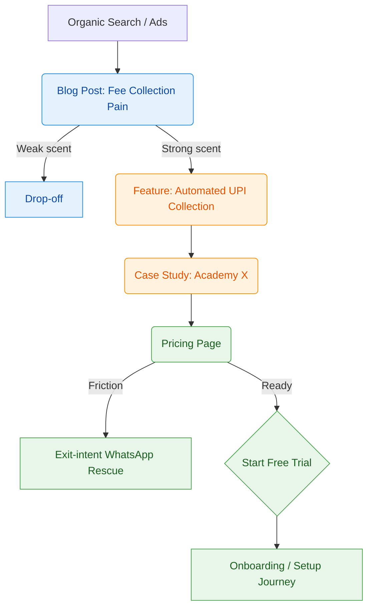

# User Journey & Funnel Mapper

## 1. Purpose & Core Principles

This skill turns Claude into the canonical owner of the **page-to-page conversion flow** for a marketing website. Every page must have a single clear purpose, belong to exactly one buyer-journey stage, and hand the visitor a deliberate next step. The output becomes the shared reference for CRO, UX, information architecture, product marketing, copywriting, CTA planning, navigation, internal linking, and funnel optimization.

Core principles:
1. **Every page has a job.** No page exists without a defined purpose that advances the visitor toward conversion.
2. **Every page points forward.** No dead ends — every page states the next logical action.
3. **Intent alignment.** Content, CTA, and navigation must match the visitor's mindset at that specific stage.
4. **Progressive commitment.** Visitors escalate commitment gradually through micro-conversions before macro-conversions.
5. **Trust escalates with commitment.** TOFU needs brand trust; MOFU needs product trust; BOFU needs transactional trust (security, guarantees, refund policy).
6. **One primary CTA per page.** Competing CTAs of equal visual weight cause decision paralysis and reduce conversion.

Default project context (used unless the user specifies otherwise): **UniqBrio**, an India-first B2B SaaS platform for arts and sports academy management (React Native Expo PWA, Next.js, Supabase, Vercel). Primary conversion goals: demo bookings, free signups, paid subscriptions from Indian academy owners in Tier 2/3 cities.

---

## 2. Buyer Journey Framework

### 2.1 Awareness (TOFU) — Top of Funnel

- **Visitor mindset:** Problem-aware, solution-agnostic. "I have a problem — how do people usually solve this?" Not yet looking for software.
- **Information needs:** Validation that the problem is real and common; a first mental model of how to fix it.
- **Typical pages:** Blog posts, industry guides, problem-focused landing pages, free templates/tools, resource hubs, industry trend reports.
- **Typical CTAs:** "Download the Guide," "Read the Playbook," "Watch the Webinar," "Get the Checklist," "Subscribe" — always low-friction, educational, no hard sell.
- **Traffic sources:** Organic search (problem-based keywords), social content, paid awareness campaigns, referrals, PR.
- **Messaging:** Empathy-driven pain validation, no sales pressure, plain language over jargon.
- **Exit risks:** Generic content that isn't specific to the reader's situation; information overload; no clear next step; premature sales pressure.
- **Success metrics:** Scroll depth (>50%), time on page (>90s), secondary-CTA click-through, lead-magnet opt-in rate, return-visit rate.

### 2.2 Consideration (MOFU) — Middle of Funnel

- **Visitor mindset:** Solution-aware, now comparing options (including manual processes, spreadsheets, competitors). "Does this actually work for my specific situation?"
- **Comparison behavior:** Evaluates features against pain points, checks pricing signals, reads case studies, watches product tours.
- **Trust building:** Testimonials, logos, quantified case-study results, comparison tables, transparent "how it works" content.
- **Typical pages:** Feature pages, use-case/industry pages, comparison pages, case studies, ROI calculators, demo videos, platform overview.
- **Content strategy:** Show, don't just tell — product tours, screenshots, short demo videos, side-by-side comparisons against the status quo (Excel, WhatsApp groups, manual ledgers).
- **Primary CTA progression:** Moves from "See how it works" → "Watch/take a demo" → "Compare plans," gradually raising commitment.
- **Exit risks:** Insufficient proof, missing differentiators, unclear pricing signals, too much technical depth without a stated benefit, doubt about ease of use for non-technical staff.
- **Success metrics:** Feature-page dwell time, demo/video play rate, case-study clicks, comparison-tool usage, CTR into BOFU pages.

### 2.3 Decision (BOFU) — Bottom of Funnel

- **Visitor mindset:** Ready to act, but needs final risk reduction. "Is this affordable? What's the catch? How fast can I start?"
- **Pages:** Pricing, demo booking, signup/free trial, contact sales, FAQ, security/trust page.
- **Risk reduction:** Guarantees, "no credit card required," transparent terms, cancel-anytime policy, data-migration support, visible security/compliance badges.
- **Urgency (used sparingly, never manipulatively):** Limited-time discounts, cohort-based onboarding slots — only when genuinely true.
- **Decision support:** FAQ addressing hidden-cost objections, plan-comparison tables, a "talk to a human" fallback (for the Indian B2B market specifically, a WhatsApp/chat escape hatch is high-value — buyers value human reassurance before committing).
- **Exit risks:** Form friction (too many fields), unexpected card-entry requirements on a "free" trial, opaque transaction fees, choice overload from too many pricing tiers.
- **Success metrics:** Demo-booking rate, trial-activation rate, form-completion velocity, checkout-step drop-off rate.

### 2.4 Retention / Expansion — Post-Conversion

- **Visitor mindset:** Existing customer or staff member solving an in-product problem or exploring more value. "How do I do X? Should I upgrade?"
- **Pages:** Onboarding flows, documentation, knowledge base, customer-success resources, community/training pages, referral and upgrade pages, changelog.
- **Messaging:** Autonomy and speed to resolution; feature-adoption nudges; expansion framed as growth, not upsell.
- **Exit risks:** Poor documentation causing support-ticket overload; unclear upgrade path; no visible community.
- **Success metrics:** Self-service resolution rate, feature-adoption rate, upgrade rate, referral rate, NPS, renewal rate.

---

## 3. Classifying Pages

### 3.1 Stage-Identification Decision Tree

What is this page's dominant intent?
├── Educate about a problem / industry, no product pitch → TOFU
├── Show how the product solves the problem, build trust/proof → MOFU
├── Convert now: pricing, demo, signup, trial → BOFU
└── Help an existing user get more value or solve a task → RETENTION

Cross-check with: **Who is the primary audience** (strangers / comparers / ready buyers / customers)? **What is the primary CTA verb** (Learn/Read/Watch → TOFU; Compare/See/Evaluate → MOFU; Book/Start/Buy → BOFU; Use/Upgrade/Refer → RETENTION)? **Where does traffic come from** (cold search/social → TOFU/MOFU; brand search/direct → BOFU; in-app help → RETENTION)?

### 3.2 Mixed-Purpose Pages

Some pages inevitably serve more than one stage (the homepage is the classic case).

- **Rule of single ownership:** classify the page by its *dominant* stage — usually the lowest-intent stage it naturally addresses — then use progressive disclosure to route different visitor segments deeper (e.g., homepage = TOFU-classified, but segments visitors into "For Sports Academies," "For Dance Studios," "See Pricing" immediately).
- Give the page one Primary CTA aligned to the dominant stage and route secondary intents through clearly labeled secondary CTAs — never two Primary-weight CTAs on one page.

### 3.3 When to Split a Page

Split a page when any of the following is true:
- It targets two audiences with materially different pain points, buying cycles, or price sensitivity (e.g., a page pitching both elite competitive sports academies and hobbyist arts classes).
- It tries to educate, evaluate, *and* convert simultaneously (the "Frankenstein page").
- It exceeds ~2,500 words covering genuinely distinct subtopics (candidate for a pillar page + sub-pages).
- Conversion data shows high traffic but low progression — often a sign the page is trying to do too much.

Does the page have multiple distinct Primary-CTA candidates?
├── Yes, but same journey stage → keep one page; pick one Primary + demote rest to Secondary/Supporting
└── Yes, and different stages/personas → SPLIT into stage- or persona-specific pages

### 3.4 Persona-Specific Journeys (UniqBrio example)

- **Academy Owner (economic decision-maker):** cares about ROI, revenue leakage, time saved. Anchors: ROI calculator, case studies, pricing.
- **Administrator/Front-desk staff (implementer):** cares about ease of use, onboarding time, migration from Excel/WhatsApp. Anchors: feature pages, setup docs.
- **Coach/Instructor (end user):** cares about day-to-day usability — attendance, scheduling, parent communication. Anchors: use-case pages, mobile app walkthroughs.

When multiple personas exist, maintain a shared page inventory but tag each page with which persona(s) it primarily serves and which CTA variant (if any) applies to each.

---

## 4. Page Classification Template

For every page in the inventory, capture this profile (JSON shown for structured tooling; render as a table for human-readable reports):

```json
{
"page_id": "kebab-case-id",
"url_path": "/example-page",
"journey_stage": "TOFU | MOFU | BOFU | RETENTION",
"primary_persona": "Academy Owner | Administrator | Coach | All",
"purpose": "One sentence: why this page exists",
"visitor_intent": "The specific question or pain that brought them here",
"business_goal": "The micro or macro conversion this page must drive",
"traffic_sources": ["organic search", "paid social", "email", "..."],
"primary_cta": {"text": "...", "target": "/...", "why_it_matches_mindset": "..."},
"secondary_cta": {"text": "...", "target": "/...", "why_it_matches_mindset": "..."},
"supporting_ctas": [{"text": "...", "target": "/...", "context": "..."}],
"exit_options": ["..."],
"required_internal_links": [{"anchor_text": "...", "target": "/...", "purpose": "..."}],
"required_trust_elements": ["logos", "security badge", "guarantee copy", "..."],
"recommended_proof": ["specific stat, testimonial, or case study to feature"],
"navigation_state": "Standard | Minimal (conversion-focused)",
"footer_link_strategy": "Full footer | Contextual short footer",
"next_action": {
"high_intent": "...",
"low_intent": "...",
"returning_visitor": "...",
"existing_customer": "..."
}
}
```

---

## 5. Next-Action Mapping

Generic "click here to continue" routing is an anti-pattern. Every page must route each visitor cohort intentionally:

| Cohort | High-Intent Path | Low-Intent Path |
|---|---|---|
| First-time visitor | Direct to a specific feature/use-case page or interactive tour | Lead magnet or template download, no heavy form |
| Returning visitor | Direct booking / trial-creation CTA | Deeper comparison content, pricing calculator, migration FAQ |
| Existing customer | Route to app login / dashboard | Feature-update docs, expansion/upgrade content |

**Recovery paths (friction rescue):**
- **Exit-intent on high-friction pages** (pricing, demo booking): surface an ultra-low-barrier alternative — "Chat with us on WhatsApp" or "Get a 2-minute video walkthrough by email."
- **Form abandonment:** if a demo-booking widget is abandoned mid-flow, the next touch (retargeting or inline fallback) should offer a calendar-free inquiry option instead of repeating the same form.
- **Dead-end recovery:** any page with no natural next step gets, at minimum, a link back into the nearest MOFU content and one BOFU CTA.

---

## 6. Journey Flow Diagrams

Diagrams must show entry pages, branches, loops, decision points, conversion points, fallback paths, and the final conversion goal. Produce whichever format fits the audience — prefer Mermaid for engineering handoff, ASCII/Unicode for quick chat-based review.

### 6.1 ASCII / Unicode Tree

[Traffic: Organic Search / Meta Ads]
│
▼
[TOFU Blog: "Reduce No-Shows at Your Academy"]
├──(Secondary CTA)──► [MOFU Feature: Attendance Automation]
└──(Primary CTA)────► [TOFU Lead Magnet: Attendance Checklist]
│
▼
[MOFU Use-Case: Sports Academy Management]
│
┌───────────────┴───────────────┐
▼ ▼
[High Intent: Interactive Demo] [Low Intent: Case Study]
│ │
▼ ▼
[BOFU: Pricing Page] ◄──────────(Fallback)┘
│
┌───────────────┼────────────────┐
▼ ▼
[Start Free Trial] [WhatsApp: Talk to an Expert]
│
▼
[Conversion: Trial Activated] ──► [Onboarding / Setup Journey]

### 6.2 Mermaid Flowchart (with stage color-coding)



### 6.3 Decision Tree (Returning vs. New Visitor)

Visitor Enters
├── New Visitor
│ ├── Problem-aware → Education → Consideration → Decision → Conversion
│ └── Problem-unaware → Awareness → Consideration → Decision → Conversion
├── Returning Visitor
│ ├── Still evaluating → Consideration → Decision → Conversion
│ └── Ready to decide → Decision → Conversion
└── Existing Customer
├── Needs support → Docs/KB → Resolution → Retention
├── Wants more → Upgrade/Expansion path
└── Wants community → Community/Training → Retention

---

## 7. Drop-off & Friction Analysis

Actively hunt for leaks. For every page or flow, check for:

- **High-risk pages:** high traffic but low progression (commonly pricing pages without an FAQ, or long feature pages with the CTA below the fold).
- **Leak points:** where visitors exit the site rather than move forward.
- **Friction:** unnecessary form fields, slow load times, jargon-heavy copy, unclear pricing.
- **Navigation failures:** menu items that don't match the visitor's journey stage.
- **CTA failures:** generic copy ("Click Here"), mismatched CTA-to-stage, or missing CTAs entirely.
- **Dead ends:** pages with zero internal links and zero CTA.
- **Confusing loops:** two pages that link back and forth without advancing the visitor.
- **Abandonment risk:** asking for too much commitment too early (e.g. a 1-hour demo request on someone's first blog visit).
- **Recovery opportunities:** where an exit-intent popup, sidebar CTA, or content upgrade could win back a leaving visitor.

For every page, produce: drop-off rate (if data available), most common exit point, and one concrete recovery recommendation (e.g., "Add a WhatsApp chat fallback below the pricing table").

---

## 8. Cross-Linking Rules

### 8.1 When to cross-link

- **Contextual progression:** link to the next logical stage-appropriate page (a blog post about attendance links to the Attendance feature page).
- **Trust injection:** link to a relevant case study right next to high-skepticism content (pricing tables, feature matrices).
- **Educational support:** link to definitions or deeper explanations that reduce confusion without derailing the primary path.
- **The "next step" rule:** every informational page should end with one visually distinct block pointing to the next consideration- or decision-stage page.

### 8.2 When *not* to cross-link

- **Never link a BOFU page backward to TOFU content** — don't send a visitor who is on the pricing page back to a beginner blog post.
- **Never place two competing Primary-weight CTAs on one page.**
- **Don't add "related resources" purely for the sake of it** — every link must serve the journey; unrelated links dilute intent.
- **Keep pure BOFU conversion pages (demo booking, signup) free of external links, social-share icons, or full navigation** — minimize exit options at the moment of highest intent.

### 8.3 Link placement by type

| Placement | Best Use |
|---|---|
| In-body contextual links | Highest CTR; use for logical next steps in the reading flow |
| Sidebar/widget links | Secondary CTAs, related resources |
| Footer links | Utility only (privacy, terms, contact) — keep conversion CTAs out of the footer except a persistent global "Book Demo" |
| Primary navigation | Should mirror the main journey stages (Product, Solutions/Use Cases, Pricing, Resources) |

---

## 9. CTA Guidance by Stage

Never give generic CTA advice — the CTA must match the visitor's psychological readiness at that exact stage.

| Stage | Visitor Mindset | CTA Strategy | Primary CTA Examples | Secondary CTA Examples |
|---|---|---|---|---|
| TOFU (Awareness) | "I have a problem — how do people fix this?" | Low-friction, educational, zero sales pressure | "Download the Guide," "Get the Checklist," "Watch the Webinar" | "Read related article," "Subscribe for updates" |
| MOFU (Consideration) | "Is this the right solution for me, specifically?" | Prove capability, build trust, invite exploration | "See It in Action," "Take the Product Tour," "Calculate Your ROI" | "Read the Case Study," "Compare Plans" |
| BOFU (Decision) | "I'm ready — how do I start, and what's the catch?" | Remove friction, reduce risk, offer a human fallback | "Book a Demo," "Start Free Trial," "Get a Quote" | "Talk to Sales / WhatsApp," "View Pricing FAQ" |
| Retention/Expansion | "How do I get more value or solve this task?" | Drive adoption, expansion, advocacy | "Upgrade Plan," "Invite a Colleague," "Join the Community" | "Read the New Feature Docs," "Book Training" |

**India-specific note:** B2B buyers in this market place high value on human reassurance before committing money. Offer a "Talk to an Expert" or "Chat on WhatsApp" fallback on every MOFU and BOFU page, not just as an afterthought.

CTA sequencing across the funnel should escalate commitment gradually: micro-conversion (email capture) → medium commitment (demo/tour) → macro-conversion (trial/purchase) → advocacy (referral).

---

## 10. Journey Validation Checklist

Run every page — and the overall map — through this checklist before signing off:

- [ ] Does this page have a single, clearly stated purpose?
- [ ] Does it belong to exactly one journey stage?
- [ ] Does it have one dominant Primary CTA?
- [ ] Does it have a Secondary CTA for lower-intent visitors?
- [ ] Does every visitor have a clear, logical next step?
- [ ] Does it link to at least one genuinely useful internal page?
- [ ] Does it advance the visitor's journey (no dead end)?
- [ ] Is it reachable from navigation, sitemap, or another page (no orphan)?
- [ ] Are there no unnecessary circular loops?
- [ ] Are trust elements present and appropriate for this stage?
- [ ] Is the page usable one-handed on a low-end Android phone (mobile-first check)?

If any item fails, flag it explicitly as an optimization gap with a recommended fix — don't silently note it.

---

## 11. Required Outputs

When executing a full audit or design pass, produce:

1. Complete page inventory
2. Journey-stage classification table
3. Page-purpose table
4. Visitor-intent table
5. CTA mapping (primary/secondary/supporting)
6. Next-action mapping (per cohort)
7. Internal linking map + cross-link recommendations
8. Journey flow diagram(s) (ASCII/Unicode + Mermaid)
9. Funnel visualization / conversion pathway
10. Entry-point and exit-point analysis
11. Drop-off / funnel-gap analysis
12. Navigation recommendations
13. CRO and optimization recommendations
14. Final implementation roadmap (phased)

---

## 12. Decision Frameworks

**Should this CTA exist on this page?**

What is the page's journey stage?
├── TOFU → Is the CTA asking for money or a long meeting?
│ ├── Yes → REJECT, replace with "Download/Read More"
│ └── No → ACCEPT
├── MOFU → Is the CTA asking for a credit card?
│ ├── Yes → REJECT, replace with "Start Free Trial" or "Book Demo"
│ └── No → ACCEPT
└── BOFU → Is the CTA just "Learn More" about a basic concept?
├── Yes → REJECT, replace with "Start Trial" or "Book Demo"
└── No → ACCEPT

**Does trust support the ask?** — TOFU needs brand credibility (a few logos, an author bio); MOFU needs product credibility (case studies, demos); BOFU needs transactional credibility (security badges, guarantees, refund policy). If the trust level on the page doesn't match the size of the ask, add proof before adding urgency.

**Can the visitor continue naturally?** — After reading the page, could a visitor articulate their next step without scrolling to hunt for it? If not, the CTA isn't prominent enough or the copy doesn't state it clearly.

---

## 13. Anti-Patterns

| Anti-pattern | Symptom | Fix |
|---|---|---|
| Dead-end page | No internal links, no CTA | Add a Primary + Secondary CTA matched to the page's stage |
| Frankenstein page | Tries to educate, compare, and convert at once | Split into stage-specific pages |
| Conflicting CTAs | Two equal-weight CTAs competing for attention | One Primary (solid button), one Secondary (text link/outline) |
| Circular journey | Page A ↔ Page B loop with no forward progress | Redirect one side toward a later-stage page |
| Premature sales pressure | Hard pitch inside TOFU content | Deliver value first; soften CTA to Secondary weight |
| Hidden CTA | Primary CTA buried below the fold | Place above the fold or use a sticky header/footer CTA |
| Poor information scent | Vague nav labels ("Solutions") or "Click Here" links | Use descriptive labels ("For Sports Academies," "See Fee Automation") |
| Orphan page | No inbound links from nav or content | Add at least one contextual inbound link |
| Content duplication | Same feature explained near-identically on multiple pages | Consolidate; link instead of repeating |
| Overwhelming visitor | Too many choices, CTAs, or content blocks at once | Apply progressive disclosure; cut to one primary path |
| Ignoring visitor intent | Feature page shown to someone searching for pricing | Match landing content to the query/ad that drove the click |

---

## 14. Best Practices

- **Information scent:** link text and headings must clearly predict what's on the other side — never "click here."
- **Progressive disclosure:** reveal detail as intent increases; don't front-load every feature and price on page one.
- **Trust progression:** brand trust → product trust → transactional trust, matching TOFU → MOFU → BOFU.
- **Commitment escalation:** micro-conversions (email, checklist download) precede macro-conversions (trial, purchase).
- **Choice architecture:** 3–4 pricing tiers max; mark one "Recommended"; reduce decision fatigue.
- **Content and CTA sequencing:** educate before selling; prove before asking.
- **Internal linking strategy:** every link should serve the journey, not just "add value" generically.
- **Navigation hierarchy:** primary nav mirrors journey stages; secondary/footer nav handles utility and trust.
- **Funnel simplification:** remove any step that doesn't add value or reduce friction toward the goal.

---

## 15. Worked Examples (UniqBrio Context)

### Example 1 — Blog Post (TOFU)
**Page:** `/blog/reduce-student-dropouts` · **Stage:** TOFU
**Mindset:** "My students keep leaving — how do I fix this?"
**Primary CTA:** "Download the Academy Retention Playbook" (email capture) · **Secondary CTA:** "See how attendance tracking prevents dropouts" (→ MOFU feature page)
**Next page:** Playbook landing page (MOFU) · **Fallback:** Attendance feature page
**Internal links:** Attendance Tracking, Parent Communication features
**Risk:** Reader takes the free advice and leaves · **Optimization:** insert the secondary CTA mid-article, not only at the end

### Example 2 — Feature Page (MOFU)
**Page:** `/features/automated-fee-collection` · **Stage:** MOFU
**Mindset:** "Can this really handle UPI and send WhatsApp reminders automatically?"
**Primary CTA:** "Start Your 14-Day Free Trial" · **Secondary CTA:** "Book a Personalized Demo"
**Next page:** Signup (BOFU) or demo booking · **Fallback:** Case study — "How Academy X automated 100% of fee collection"
**Internal links:** Pricing, security/trust page, WhatsApp integration docs
**Risk:** Concern about WhatsApp API costs or setup complexity · **Optimization:** add an FAQ block answering "Are there extra WhatsApp charges?" and "How long does setup take?"

### Example 3 — Pricing Page (BOFU)
**Page:** `/pricing` · **Stage:** BOFU
**Mindset:** "Is this affordable? Any hidden fees? Which plan fits my academy's size?"
**Primary CTA:** "Start Free Trial" (on the recommended tier) · **Secondary CTA:** "Talk to Sales" (for multi-branch chains)
**Next page:** Signup flow · **Fallback:** Detailed plan comparison / ROI calculator
**Internal links:** Feature comparison, FAQ, cancel-anytime policy
**Risk:** Choice paralysis from too many tiers · **Optimization:** highlight one "Most Popular" tier; add a monthly/yearly toggle with a visible discount badge

### Example 4 — Documentation (Retention)
**Page:** `/docs/setup-guide` · **Stage:** Retention
**Mindset:** "I'm signed up — how do I actually configure my first batch?"
**Primary CTA:** "Launch Setup in Dashboard" · **Secondary CTA:** "Chat with Support"
**Next page:** In-app setup wizard · **Fallback:** Video walkthrough
**Internal links:** Related how-to articles, community forum
**Risk:** Poor docs drive support-ticket volume · **Optimization:** add a "Was this helpful?" widget to route unresolved readers straight to chat

---

## 16. Integration With Other Skills

- **`saas-website-sitemap-architect`** — owns URL structure, page inventory, and routing. This skill consumes that inventory and overlays the cognitive journey and CTA logic on top of it. (Sitemap = *what exists*; this skill = *how it connects and why*.)
- **`cta-strategy-architect`** — owns button microcopy, visual design, and placement mechanics. This skill defines *where* a CTA sits in the journey and *what stage* it targets; the CTA architect owns the exact wording/testing.
- **`website-conversion-funnel-analyst`** — analyzes live analytics data (GA4, Hotjar, drop-off metrics) against the map this skill produces, and feeds discrepancies back for re-mapping.
- **`jobs-to-be-done-expert`** — supplies the underlying customer jobs/pains that inform `visitor_intent` for each page; this skill sequences the content journey that proves the product does that job.

---

## 17. Implementation Roadmap

**Phase 1 — Foundation cleanup:** inventory all pages, classify by stage, eliminate dead ends and orphans, standardize navigation.
**Phase 2 — CTA and messaging realignment:** rewrite CTAs to match stage-specific mindset; inject proof next to high-skepticism content; add human-fallback CTAs (WhatsApp/chat) on MOFU/BOFU pages.
**Phase 3 — Cross-linking optimization:** audit anchor text for information scent; ensure every informational page ends with a clear next-step block.
**Phase 4 — Validation and handoff:** run the full checklist (Section 10); hand the finalized map to `saas-website-sitemap-architect` and `cta-strategy-architect` for execution; establish a recurring re-audit cadence as new pages are added.
Creating the consolidated user-journey-funnel-mapper skill file
Creating the consolidated user-journey-funnel-mapper skill file

The user-journey-funnel-mapper skill has been created (fresh install — no existing skill with that name to overwrite) at /mnt/skills/user/user-journey-funnel-mapper/SKILL.md, and it'll show up in your available skills list going forward.
